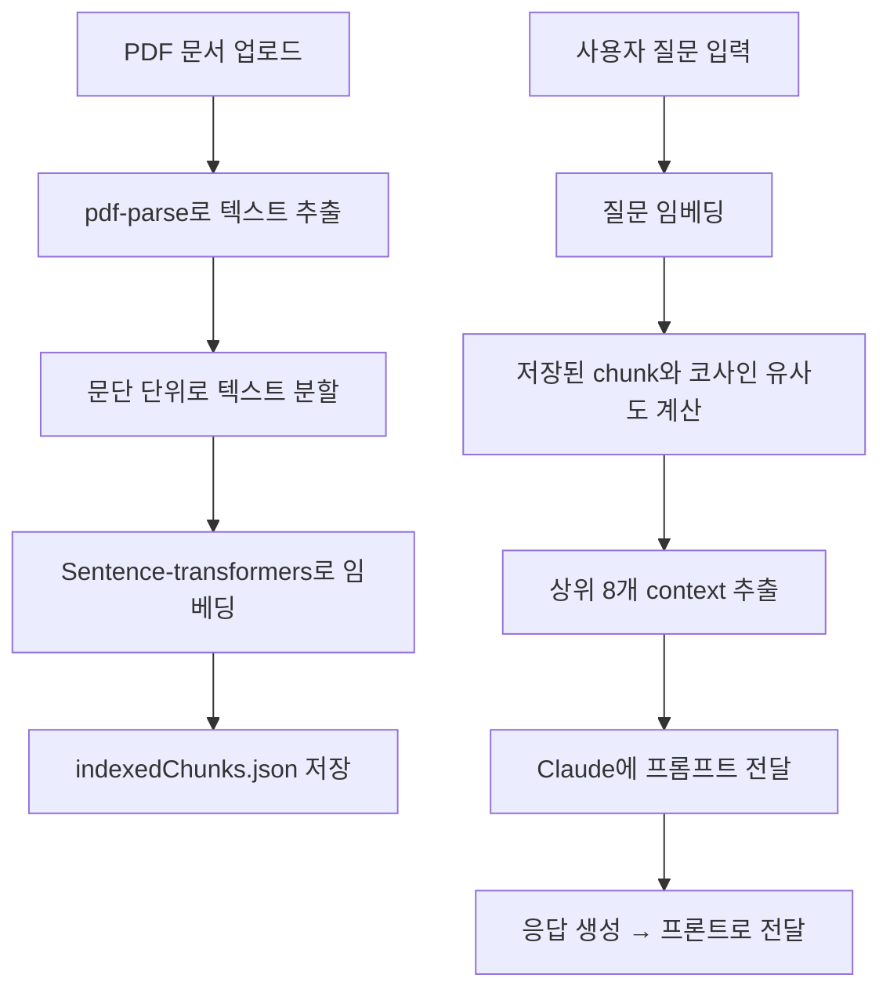

# Friday

**Friday**는 PDF 문서를 기반으로 자신만의 전문 분야 챗봇을 만들 수 있는 오픈소스 프로젝트입니다. <br/>
의료, HR, 법무, 상담 등 다양한 도메인에서 활용할 수 있으며,<br/>
Claude (AWS Bedrock) 또는 OpenAI와 연동되어 질문에 정확한 근거 기반 응답을 제공합니다.<br/>
전체 시스템은 **RAG (Retrieval-Augmented Generation)** 구조를 따릅니다.

---

## Tech Stack

-  **Client**: Next.js, TypeScript, TailwindCSS, shadcn/ui, next-pwa
-  **Server**: Node.js, Express, TypeScript
-  **Embedding**: sentence-transformers (`Xenova/all-MiniLM-L6-v2`)
-  **Tools**: AWS Bedrock (Claude Instant), pdf-parse
-  **Architecture**: Retrieval-Augmented Generation (RAG)

---

## System Overview



---

## Getting Started

### 1. 프로젝트 클론 및 의존성 설치

```bash
git clone https://github.com/Nayejun/Friday.git
cd friday
npm install
```

### 2. 초기 설정 CLI

```bash
npx tsx friday-init.ts
```

> CLI에서 챗봇 이름, Claude 모델 ID, AWS/OpenAI 키, 접속 코드 등을 입력하면 다음 파일들이 자동 생성됩니다:

-  `friday-server/.env`
-  `friday-client/.env`
-  `friday-client/middleware.ts`
-  (선택 시) `friday-client/public/manifest.json`

---

### 3. 문서 업로드

```bash
# 챗봇이 참고할 PDF 문서를 아래 경로에 업로드하세요
friday-server/docs/
└── my-manual.pdf
```

> 예: 진료 가이드, 사내 정책집, 제품 매뉴얼 등

---

### 4. 문서 임베딩 생성

```bash
cd friday-server
npm run index
```

> 문서를 문단 단위로 분리하고, 벡터 임베딩 결과를 `indexedChunks.json`에 저장합니다.

---

### 5. 서버 실행

```bash
cd ../friday-server
npm run start
```

---

### 6. 클라이언트 실행

```bash
cd ../friday-client
npm install
npm run build
npm start
```

> `http://localhost:3000`에서 웹 앱을 확인할 수 있습니다.

---

### 7. 챗봇 접속

-  초기 설정 시 입력한 **접속 코드(secret code)** 를 입력해야 `/chat` 페이지에 접근할 수 있습니다.
-  해당 코드는 `.env`, `middleware.ts`, `.env.local` 등에 자동 반영됩니다.
-  `/usage`는 직접 입력하여 접속할 수 있습니다.(http://localhost:3000/usage) 사용량 및 예상 과금 비용을 확인할 수 있습니다.

---

## API

-  `POST /ask`: 질문 요청
-  `GET /usage`: 토큰 사용량, 평균 질문 길이, 예측 비용
-  `POST /reset`: 사용량 초기화

---

## 프롬프트 커스터마이징

`friday-server/prompts/prompt.txt` 파일을 수정하면 챗봇의 응답 스타일을 변경할 수 있습니다.

`Ex` **HR 챗봇 프롬프트**:

```
당신은 회사의 HR 챗봇입니다.
당일 연차 사용은 반드시 담당자에게 직접 문의하라고 말하세요.
나머지 내용은 사내 내규 PDF 문서를 참고하여 답변하세요.
...
```

---

## PWA 지원

초기 설정 CLI에서 PWA로 설정하시겠습니까? 질문에 Yes를 선택하면,<br/>
웹 앱을 모바일 홈 화면에 설치할 수 있도록 manifest.json이 자동 생성됩니다.

`friday-client/public/manifest.json`

PWA를 사용하려면 아이콘 파일도 다음 위치에 준비되어 있어야 합니다:

`friday-client/public/icon-192.png`<br/>
`friday-client/public/icon-512.png`

---

## 라이선스

MIT License

---

## 기여

Pull Request와 Issue는 언제든 환영합니다.
